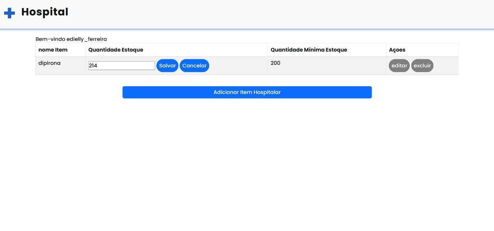
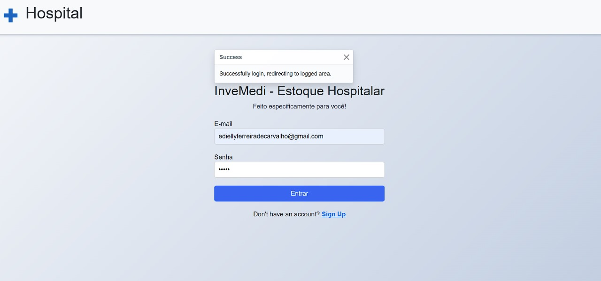
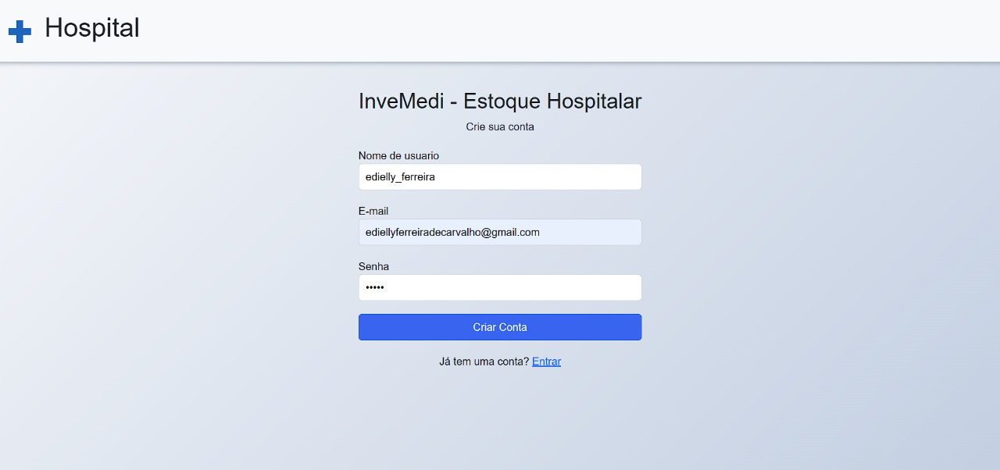
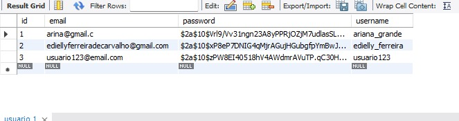

# InveMedi

InveMedi é um sistema de gerenciamento de estoque hospitalar desenvolvido com Spring Boot e Java. Ele permite que os usuários gerenciem itens de estoque hospitalar, incluindo a criação, atualização, exclusão e visualização de itens.

## Funcionalidades

- Gerenciamento de usuários
- Gerenciamento de itens de estoque hospitalar
- Autenticação e autorização com JWT
- Manipulação de exceções globais
- Integração com banco de dados MySQL

## Tecnologias Utilizadas

- Java 17
- Spring Boot 3.4.3
- Spring Security
- Spring Data JPA
- MySQL
- Lombok
- JWT (JSON Web Token)
- Maven
- JavaScript
- HTML
- CSS

## Configuração do Ambiente

1. Clone o repositório:
   ```sh
   git clone https://github.com/EdiellyF/inveMedi.git
   ```

2. Configure o banco de dados MySQL no arquivo `application.properties`:
   ```
   spring.datasource.password=
   spring.datasource.username=
   rootspring.datasource.url=jdbc:mysql://localhost:3306/invemedi?useSSL=false&serverTimezone=UTC
   ```

3. Construa o projeto usando Maven:
   ```sh
   ./mvnw clean install
   ```

4. Execute o projeto usando Maven:
   ```sh
   ./mvnw spring-boot:run
   ```

## Usuários

- `GET /user/{id}`: Busca um usuário pelo ID (somente usuários admin têm essa possibilidade)
- `POST /user`: Cria um novo usuário (rota pública, todos têm autorização para criar um usuário)
- `PUT /user/{id}`: Atualiza um usuário existente (somente o próprio usuário e o admin podem atualizar)
- `DELETE /user/{id}`: Deleta um usuário

### Itens de Estoque

- `GET /itens/{id}`: Busca um item de estoque pelo ID
- `GET /itens/user/{userId}`: Busca todos os itens de estoque de um usuário
- `POST /itens`: Cria um novo item de estoque (não é permitido criar itens com nomes duplicados por ser um estoque)
- `PUT /itens/{id}`: Atualiza um item de estoque existente (somente a quantidade do estoque atual)
- `DELETE /itens/{id}`: Deleta um item de estoque

## Autenticação

A autenticação é feita utilizando JWT. Para obter um token, faça uma requisição `POST` para `/login` com as credenciais do usuário.

## Contribuição

Contribuições são bem-vindas! Sinta-se à vontade para abrir issues e pull requests.

Se tiver alguma dúvida, envie um email para [ediellyferreiradecarvalho@gmail.com](mailto:ediellyferreiradecarvalho@gmail.com).







